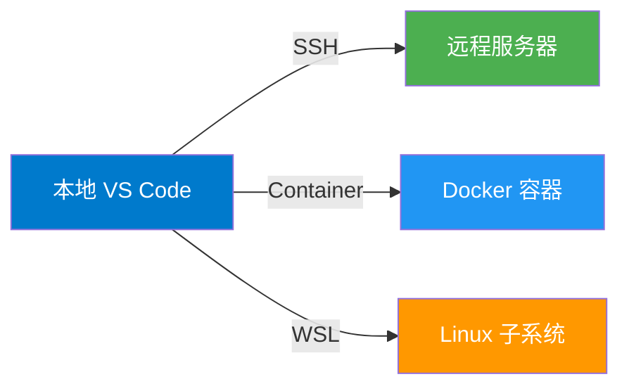

# Visual Studio Code 开发环境配置指南

!!! abstract "概述"
    本文档详细介绍了如何配置和优化 Visual Studio Code（VS Code）开发环境，涵盖基础设置、扩展推荐、工作区配置以及针对不同编程语言的最佳实践。适用于从初学者到高级开发者的各个层次。

---

## 引言

Visual Studio Code 是由 Microsoft 开发的一款免费、开源、跨平台的代码编辑器。自 2015 年发布以来，VS Code 凭借其轻量级、高度可定制化和丰富的扩展生态系统，已成为全球最受欢迎的开发工具之一。

### 为什么选择 VS Code？

> "VS Code 重新定义了代码编辑器应该具备的功能。"
> 
> —— Stack Overflow 开发者调查 2025

**核心优势：**

- :material-lightning-bolt: **轻量快速**：启动速度快，资源占用低
- :material-puzzle: **扩展丰富**：超过 30,000+ 扩展可用
- :material-code-braces: **智能提示**：IntelliSense 提供强大的代码补全
- :material-git: **Git 集成**：内置版本控制支持
- :material-debug: **调试工具**：强大的调试功能
- :material-monitor-multiple: **跨平台**：支持 Windows、macOS、Linux

---

## 安装与初始设置

### 下载安装

!!! info "下载地址"
    官方网站：[https://code.visualstudio.com/](https://code.visualstudio.com/)
    
    - **Windows**：下载 `.exe` 安装程序
    - **macOS**：下载 `.dmg` 或使用 Homebrew: `brew install --cask visual-studio-code`
    - **Linux**：下载 `.deb` / `.rpm` 或使用 Snap: `snap install code --classic`

### 首次启动配置

安装完成后，首次启动 VS Code 时建议进行以下配置：

=== "主题设置"
    **1. 颜色主题**
    
    按 ++ctrl+k++ ++ctrl+t++ 打开主题选择器：
    
    - **Dark+ (default dark)** - 深色主题（推荐）
    - **Light+ (default light)** - 浅色主题
    - **Monokai** - 经典配色
    - **Solarized Dark** - 护眼配色
    
    ```json title="settings.json"
    {
        "workbench.colorTheme": "Default Dark+"
    }
    ```

=== "字体配置"
    **2. 编辑器字体**
    
    推荐使用等宽编程字体：
    
    - **Fira Code**（支持连字）
    - **JetBrains Mono**
    - **Cascadia Code**
    - **Source Code Pro**
    
    ```json title="settings.json"
    {
        "editor.fontFamily": "'JetBrains Mono', 'Fira Code', Consolas, monospace",
        "editor.fontSize": 14,
        "editor.fontLigatures": true,
        "editor.lineHeight": 22
    }
    ```

=== "基础设置"
    **3. 编辑器行为**
    
    ```json title="settings.json"
    {
        // 自动保存
        "files.autoSave": "afterDelay",
        "files.autoSaveDelay": 1000,
        
        // 显示空白字符
        "editor.renderWhitespace": "boundary",
        
        // 自动格式化
        "editor.formatOnSave": true,
        "editor.formatOnPaste": true,
        
        // 迷你地图
        "editor.minimap.enabled": true,
        "editor.minimap.maxColumn": 80,
        
        // 括号配对
        "editor.bracketPairColorization.enabled": true,
        "editor.guides.bracketPairs": true
    }
    ```

---

## 核心配置详解

### 1. 用户设置 vs 工作区设置

VS Code 提供了两个级别的配置：

| 配置类型 | 作用范围 | 配置文件位置 | 优先级 |
|---------|---------|------------|--------|
| **用户设置** | 全局所有项目 | `~/.config/Code/User/settings.json` | 低 |
| **工作区设置** | 当前项目 | `.vscode/settings.json` | 高 |

!!! tip "最佳实践"
    - **用户设置**：配置个人偏好（字体、主题、快捷键）
    - **工作区设置**：配置项目特定内容（格式化规则、linter 配置）

### 2. settings.json 完整配置示例

```json title="settings.json" linenums="1" hl_lines="3 4 11 12"
{
    // ==================== 编辑器外观 ====================
    "workbench.colorTheme": "Default Dark+",
    "workbench.iconTheme": "material-icon-theme",
    "window.zoomLevel": 0,
    
    // ==================== 字体设置 ====================
    "editor.fontFamily": "'JetBrains Mono', monospace",
    "editor.fontSize": 14,
    "editor.lineHeight": 22,
    "editor.fontLigatures": true,
    "editor.fontWeight": "400",
    
    // ==================== 编辑器行为 ====================
    "editor.tabSize": 4,
    "editor.insertSpaces": true,
    "editor.detectIndentation": true,
    "editor.wordWrap": "on",
    "editor.formatOnSave": true,
    "editor.formatOnPaste": false,
    "editor.codeActionsOnSave": {
        "source.organizeImports": "explicit",
        "source.fixAll": "explicit"
    },
    
    // ==================== 文件处理 ====================
    "files.autoSave": "afterDelay",
    "files.autoSaveDelay": 1000,
    "files.encoding": "utf8",
    "files.eol": "\n",
    "files.trimTrailingWhitespace": true,
    "files.insertFinalNewline": true,
    
    // ==================== 搜索排除 ====================
    "search.exclude": {
        "**/node_modules": true,
        "**/bower_components": true,
        "**/*.code-search": true,
        "**/dist": true,
        "**/build": true,
        "**/.git": true
    },
    
    // ==================== Git 配置 ====================
    "git.enabled": true,
    "git.autofetch": true,
    "git.confirmSync": false,
    "git.enableSmartCommit": true,
    
    // ==================== 终端配置 ====================
    "terminal.integrated.fontSize": 13,
    "terminal.integrated.fontFamily": "'JetBrains Mono', monospace",
    "terminal.integrated.cursorStyle": "line",
    "terminal.integrated.defaultProfile.windows": "Git Bash",
    
    // ==================== IntelliSense ====================
    "editor.suggest.insertMode": "replace",
    "editor.acceptSuggestionOnCommitCharacter": true,
    "editor.quickSuggestions": {
        "other": true,
        "comments": false,
        "strings": true
    },
    
    // ==================== 代码提示 ====================
    "editor.inlayHints.enabled": "on",
    "editor.parameterHints.enabled": true,
    "editor.suggestSelection": "first",
    
    // ==================== 诊断 ====================
    "problems.showCurrentInStatus": true,
    "problems.sortOrder": "severity"
}
```

### 3. keybindings.json 快捷键配置

自定义快捷键可以大幅提升开发效率：

```json title="keybindings.json"
[
    // 复制当前行到上/下方
    {
        "key": "ctrl+shift+alt+down",
        "command": "editor.action.copyLinesDownAction",
        "when": "editorTextFocus"
    },
    {
        "key": "ctrl+shift+alt+up",
        "command": "editor.action.copyLinesUpAction",
        "when": "editorTextFocus"
    },
    
    // 删除当前行
    {
        "key": "ctrl+shift+k",
        "command": "editor.action.deleteLines",
        "when": "editorTextFocus"
    },
    
    // 快速打开终端
    {
        "key": "ctrl+`",
        "command": "workbench.action.terminal.toggleTerminal"
    },
    
    // 格式化文档
    {
        "key": "ctrl+shift+f",
        "command": "editor.action.formatDocument",
        "when": "editorTextFocus"
    },
    
    // 多光标编辑
    {
        "key": "ctrl+alt+down",
        "command": "editor.action.insertCursorBelow"
    },
    {
        "key": "ctrl+alt+up",
        "command": "editor.action.insertCursorAbove"
    }
]
```

---

## 必备扩展推荐

### 通用扩展

#### 1. 代码质量与格式化

=== "Prettier"
    **Prettier - Code formatter**
    
    自动格式化代码，支持多种语言。
    
    ```json title="settings.json"
    {
        "editor.defaultFormatter": "esbenp.prettier-vscode",
        "prettier.semi": true,
        "prettier.singleQuote": true,
        "prettier.tabWidth": 2,
        "prettier.trailingComma": "es5",
        "prettier.printWidth": 80
    }
    ```
    
    **安装**：`ext install esbenp.prettier-vscode`

=== "ESLint"
    **ESLint**
    
    JavaScript/TypeScript 代码检查工具。
    
    ```json title="settings.json"
    {
        "eslint.enable": true,
        "eslint.validate": [
            "javascript",
            "javascriptreact",
            "typescript",
            "typescriptreact"
        ],
        "editor.codeActionsOnSave": {
            "source.fixAll.eslint": "explicit"
        }
    }
    ```
    
    **安装**：`ext install dbaeumer.vscode-eslint`

=== "EditorConfig"
    **EditorConfig for VS Code**
    
    跨编辑器代码风格统一。
    
    ```ini title=".editorconfig"
    root = true
    
    [*]
    charset = utf-8
    end_of_line = lf
    insert_final_newline = true
    trim_trailing_whitespace = true
    
    [*.{js,ts,json,md}]
    indent_style = space
    indent_size = 2
    
    [*.py]
    indent_style = space
    indent_size = 4
    ```
    
    **安装**：`ext install EditorConfig.EditorConfig`

#### 2. Git 工具

!!! example "GitLens — Git supercharged"
    GitLens 增强了 VS Code 内置的 Git 功能。
    
    **核心功能：**
    - 📝 **行内 Blame**：显示每行代码的提交信息
    - 🔍 **文件历史**：可视化文件修改历史
    - 🌳 **分支对比**：直观的分支比较界面
    - 👥 **协作视图**：查看团队成员贡献
    
    ```json title="settings.json"
    {
        "gitlens.currentLine.enabled": true,
        "gitlens.hovers.currentLine.over": "line",
        "gitlens.codeLens.enabled": true
    }
    ```
    
    **安装**：`ext install eamodio.gitlens`

#### 3. 远程开发



**Remote Development Pack** 包含：
- Remote - SSH
- Remote - Containers
- Remote - WSL

```json title="settings.json"
{
    "remote.SSH.remotePlatform": {
        "your-server": "linux"
    },
    "remote.SSH.showLoginTerminal": true
}
```

**安装**：`ext install ms-vscode-remote.vscode-remote-extensionpack`

---

## 语言特定配置

### Python 开发环境

#### 必备扩展

1. **Python** (ms-python.python)
2. **Pylance** (ms-python.vscode-pylance)
3. **Python Debugger** (ms-python.debugpy)

#### 配置示例

```json title=".vscode/settings.json"
{
    // Python 解释器
    "python.defaultInterpreterPath": "${workspaceFolder}/.venv/bin/python",
    
    // Linting
    "python.linting.enabled": true,
    "python.linting.pylintEnabled": true,
    "python.linting.flake8Enabled": true,
    
    // 格式化
    "python.formatting.provider": "black",
    "python.formatting.blackArgs": ["--line-length", "88"],
    
    // 类型检查
    "python.analysis.typeCheckingMode": "basic",
    "python.analysis.autoImportCompletions": true,
    
    // 测试
    "python.testing.pytestEnabled": true,
    "python.testing.unittestEnabled": false
}
```

#### 虚拟环境配置

```bash
# 创建虚拟环境
python -m venv .venv

# 激活虚拟环境
# Windows
.venv\Scripts\activate
# Linux/macOS
source .venv/bin/activate

# 安装依赖
pip install -r requirements.txt
```

#### launch.json 调试配置

```json title=".vscode/launch.json"
{
    "version": "0.2.0",
    "configurations": [
        {
            "name": "Python: 当前文件",
            "type": "debugpy",
            "request": "launch",
            "program": "${file}",
            "console": "integratedTerminal",
            "justMyCode": true
        },
        {
            "name": "Python: Django",
            "type": "debugpy",
            "request": "launch",
            "program": "${workspaceFolder}/manage.py",
            "args": ["runserver"],
            "django": true,
            "justMyCode": true
        },
        {
            "name": "Python: Flask",
            "type": "debugpy",
            "request": "launch",
            "module": "flask",
            "env": {
                "FLASK_APP": "app.py",
                "FLASK_DEBUG": "1"
            },
            "args": ["run", "--no-debugger", "--no-reload"],
            "jinja": true,
            "justMyCode": true
        }
    ]
}
```

### C/C++ 开发环境

#### 必备扩展

1. **C/C++** (ms-vscode.cpptools)
2. **C/C++ Extension Pack** (ms-vscode.cpptools-extension-pack)
3. **CMake Tools** (ms-vscode.cmake-tools)

#### c_cpp_properties.json

```json title=".vscode/c_cpp_properties.json"
{
    "configurations": [
        {
            "name": "Linux",
            "includePath": [
                "${workspaceFolder}/**",
                "/usr/include",
                "/usr/local/include"
            ],
            "defines": [],
            "compilerPath": "/usr/bin/gcc",
            "cStandard": "c17",
            "cppStandard": "c++17",
            "intelliSenseMode": "linux-gcc-x64"
        },
        {
            "name": "Windows",
            "includePath": [
                "${workspaceFolder}/**"
            ],
            "defines": ["_DEBUG", "UNICODE", "_UNICODE"],
            "compilerPath": "C:/mingw64/bin/g++.exe",
            "cStandard": "c17",
            "cppStandard": "c++17",
            "intelliSenseMode": "windows-gcc-x64"
        }
    ],
    "version": 4
}
```

#### tasks.json 编译任务

```json title=".vscode/tasks.json"
{
    "version": "2.0.0",
    "tasks": [
        {
            "label": "build",
            "type": "shell",
            "command": "g++",
            "args": [
                "-g",
                "${file}",
                "-o",
                "${fileDirname}/${fileBasenameNoExtension}"
            ],
            "group": {
                "kind": "build",
                "isDefault": true
            },
            "problemMatcher": ["$gcc"],
            "detail": "编译当前文件"
        }
    ]
}
```

### JavaScript/TypeScript 开发环境

#### 必备扩展

1. **ESLint** (dbaeumer.vscode-eslint)
2. **Prettier** (esbenp.prettier-vscode)
3. **npm Intellisense** (christian-kohler.npm-intellisense)
4. **Path Intellisense** (christian-kohler.path-intellisense)

#### jsconfig.json / tsconfig.json

=== "jsconfig.json"
    ```json
    {
        "compilerOptions": {
            "target": "ES2020",
            "module": "ESNext",
            "moduleResolution": "node",
            "lib": ["ES2020", "DOM"],
            "baseUrl": ".",
            "paths": {
                "@/*": ["src/*"],
                "@components/*": ["src/components/*"]
            }
        },
        "include": ["src/**/*"],
        "exclude": ["node_modules", "dist"]
    }
    ```

=== "tsconfig.json"
    ```json
    {
        "compilerOptions": {
            "target": "ES2020",
            "module": "ESNext",
            "lib": ["ES2020", "DOM"],
            "jsx": "react-jsx",
            "strict": true,
            "esModuleInterop": true,
            "skipLibCheck": true,
            "forceConsistentCasingInFileNames": true,
            "moduleResolution": "node",
            "resolveJsonModule": true,
            "isolatedModules": true,
            "noEmit": true,
            "baseUrl": ".",
            "paths": {
                "@/*": ["src/*"]
            }
        },
        "include": ["src"],
        "exclude": ["node_modules", "dist", "build"]
    }
    ```

---

## 项目工作区配置

### .vscode 文件夹结构

一个完整的项目工作区配置通常包含以下文件：

```
.vscode/
├── settings.json      # 工作区设置
├── launch.json        # 调试配置
├── tasks.json         # 任务配置
├── extensions.json    # 推荐扩展
└── c_cpp_properties.json  # C/C++ 配置（如果需要）
```

### extensions.json - 推荐扩展

```json title=".vscode/extensions.json"
{
    "recommendations": [
        // 通用
        "esbenp.prettier-vscode",
        "editorconfig.editorconfig",
        "eamodio.gitlens",
        
        // Python
        "ms-python.python",
        "ms-python.vscode-pylance",
        
        // JavaScript/TypeScript
        "dbaeumer.vscode-eslint",
        "christian-kohler.npm-intellisense",
        
        // Markdown
        "yzhang.markdown-all-in-one",
        "davidanson.vscode-markdownlint",
        
        // Docker
        "ms-azuretools.vscode-docker",
        
        // Git
        "donjayamanne.githistory"
    ],
    "unwantedRecommendations": []
}
```

### 多根工作区

对于包含多个子项目的大型项目，可以使用多根工作区：

```json title="project.code-workspace"
{
    "folders": [
        {
            "name": "Frontend",
            "path": "./frontend"
        },
        {
            "name": "Backend",
            "path": "./backend"
        },
        {
            "name": "Shared",
            "path": "./shared"
        }
    ],
    "settings": {
        "files.exclude": {
            "**/node_modules": true,
            "**/__pycache__": true
        }
    }
}
```

---

## 调试技巧

### 断点类型

VS Code 支持多种断点类型：

| 断点类型 | 快捷键 | 说明 |
|---------|--------|------|
| **普通断点** | ++f9++ | 在当前行设置断点 |
| **条件断点** | 右键 → 添加条件断点 | 满足条件时暂停 |
| **日志点** | 右键 → 添加日志点 | 输出日志而不暂停 |
| **函数断点** | 调试面板 | 在函数入口暂停 |

### 调试面板快捷键

- ++f5++ : 开始调试 / 继续
- ++f10++ : 单步跳过（Step Over）
- ++f11++ : 单步进入（Step Into）
- ++shift+f11++ : 单步跳出（Step Out）
- ++ctrl+shift+f5++ : 重启调试
- ++shift+f5++ : 停止调试

### 监视表达式

在调试面板的"监视"部分可以添加表达式，实时查看变量值的变化：

```python
# 示例：监视列表长度和元素
data = [1, 2, 3, 4, 5]

# 添加监视表达式：
# - len(data)
# - data[0] if len(data) > 0 else None
# - sum(data)
```

---

## 性能优化

### 提升 VS Code 性能的建议

!!! warning "大型项目性能问题"
    如果你的项目包含大量文件，VS Code 可能会变慢。以下是优化建议：

#### 1. 排除不必要的文件

```json title="settings.json"
{
    "files.watcherExclude": {
        "**/.git/objects/**": true,
        "**/.git/subtree-cache/**": true,
        "**/node_modules/**": true,
        "**/dist/**": true,
        "**/build/**": true,
        "**/.venv/**": true
    },
    "files.exclude": {
        "**/__pycache__": true,
        "**/*.pyc": true,
        "**/.pytest_cache": true
    }
}
```

#### 2. 禁用不需要的扩展

使用"扩展"面板禁用不常用的扩展，或针对特定工作区启用扩展。

#### 3. 调整搜索设置

```json title="settings.json"
{
    "search.followSymlinks": false,
    "search.useIgnoreFiles": true,
    "search.maxResults": 10000
}
```

#### 4. 减少自动保存频率

```json title="settings.json"
{
    "files.autoSave": "onFocusChange",  // 或 "off"
    "files.autoSaveDelay": 5000
}
```

---

## 高级技巧

### 1. 代码片段（Snippets）

创建自定义代码片段可以大幅提升编码速度。

#### 创建 Python 代码片段

按 ++ctrl+shift+p++ → 输入 "Snippets: Configure User Snippets" → 选择 "python.json"

```json title="python.json"
{
    "ROS Node Template": {
        "prefix": "rosnode",
        "body": [
            "#!/usr/bin/env python3",
            "import rospy",
            "from ${1:std_msgs.msg} import ${2:String}",
            "",
            "class ${3:MyNode}:",
            "    def __init__(self):",
            "        rospy.init_node('${4:my_node}')",
            "        self.pub = rospy.Publisher('${5:topic}', ${2}, queue_size=10)",
            "        self.rate = rospy.Rate(${6:10})",
            "        ",
            "    def run(self):",
            "        while not rospy.is_shutdown():",
            "            # TODO: Add your code here",
            "            $0",
            "            self.rate.sleep()",
            "",
            "if __name__ == '__main__':",
            "    try:",
            "        node = ${3}()",
            "        node.run()",
            "    except rospy.ROSInterruptException:",
            "        pass"
        ],
        "description": "Create a ROS node template"
    }
}
```

使用时输入 `rosnode` 然后按 ++tab++ 即可展开。

### 2. 多光标编辑

多光标编辑可以同时编辑多个位置：

- ++alt+click++ : 添加光标
- ++ctrl+alt+up++ / ++ctrl+alt+down++ : 在上/下方添加光标
- ++ctrl+d++ : 选中下一个相同内容
- ++ctrl+shift+l++ : 选中所有相同内容

**示例场景：**

```python
# 需要将所有变量名从 old_name 改为 new_name
old_name = 1
print(old_name)
result = old_name + 2

# 1. 双击选中 old_name
# 2. 按 Ctrl+Shift+L 选中所有
# 3. 输入 new_name 即可全部替换
```

### 3. 正则表达式搜索替换

按 ++ctrl+h++ 打开替换面板，启用正则表达式模式（++alt+r++）：

**示例：重命名函数参数**

```python
# 查找：def (\w+)\((\w+), (\w+)\):
# 替换：def $1(first_arg, second_arg):

# 前：
def calculate(a, b):
    return a + b

# 后：
def calculate(first_arg, second_arg):
    return first_arg + second_arg
```

### 4. Emmet 快速编写 HTML

Emmet 是内置的 HTML/CSS 快速编写工具：

```html
<!-- 输入：div.container>ul>li*3>a -->
<!-- 按 Tab 展开为： -->
<div class="container">
    <ul>
        <li><a href=""></a></li>
        <li><a href=""></a></li>
        <li><a href=""></a></li>
    </ul>
</div>
```

---

## 团队协作配置

### EditorConfig 统一编码风格

```ini title=".editorconfig"
# EditorConfig is awesome: https://EditorConfig.org

root = true

# 所有文件的默认设置
[*]
charset = utf-8
end_of_line = lf
insert_final_newline = true
trim_trailing_whitespace = true

# Python 文件
[*.py]
indent_style = space
indent_size = 4
max_line_length = 88

# JavaScript/TypeScript
[*.{js,ts,jsx,tsx}]
indent_style = space
indent_size = 2

# JSON
[*.json]
indent_style = space
indent_size = 2

# YAML
[*.{yml,yaml}]
indent_style = space
indent_size = 2

# Markdown
[*.md]
trim_trailing_whitespace = false
max_line_length = 80
```

### Git Hooks 自动检查

使用 Pre-commit 钩子确保代码质量：

```bash
# 安装 pre-commit
pip install pre-commit

# 创建配置文件
```

```yaml title=".pre-commit-config.yaml"
repos:
  - repo: https://github.com/pre-commit/pre-commit-hooks
    rev: v4.5.0
    hooks:
      - id: trailing-whitespace
      - id: end-of-file-fixer
      - id: check-yaml
      - id: check-added-large-files
        args: ['--maxkb=500']

  - repo: https://github.com/psf/black
    rev: 24.1.0
    hooks:
      - id: black
        language_version: python3.11

  - repo: https://github.com/pycqa/flake8
    rev: 7.0.0
    hooks:
      - id: flake8
        args: ['--max-line-length=88']
```

```bash
# 安装钩子
pre-commit install

# 手动运行
pre-commit run --all-files
```

---

## 常见问题解决

### Q1: VS Code 启动缓慢

??? question "解决方案"
    **诊断方法：**
    
    1. 按 ++ctrl+shift+p++ → 输入 "Developer: Startup Performance"
    2. 查看启动时间统计
    
    **优化措施：**
    
    - 禁用不必要的扩展
    - 减少自动保存频率
    - 排除大型目录（如 node_modules）
    - 更新到最新版本
    
    ```json
    {
        "extensions.autoUpdate": false,
        "extensions.autoCheckUpdates": false
    }
    ```

### Q2: IntelliSense 不工作

??? question "解决方案"
    **Python：**
    
    1. 确保已安装 Pylance 扩展
    2. 检查 Python 解释器路径
    3. 重建索引：++ctrl+shift+p++ → "Python: Restart Language Server"
    
    **C/C++：**
    
    1. 检查 `c_cpp_properties.json` 配置
    2. 确保 `compilerPath` 正确
    3. 运行：++ctrl+shift+p++ → "C/C++: Reset IntelliSense Database"

### Q3: Git 集成问题

??? question "解决方案"
    ```json
    {
        "git.enabled": true,
        "git.path": "C:/Program Files/Git/bin/git.exe",  // Windows
        "git.autofetch": true
    }
    ```
    
    如果仍有问题，在终端运行：
    ```bash
    git config --global user.name "Your Name"
    git config --global user.email "your.email@example.com"
    ```

### Q4: 终端字符显示乱码

??? question "解决方案"
    ```json
    {
        "terminal.integrated.fontFamily": "monospace",
        "terminal.integrated.defaultProfile.windows": "Git Bash",
        "terminal.integrated.profiles.windows": {
            "PowerShell": {
                "source": "PowerShell",
                "args": ["-NoExit", "-Command", "chcp 65001"]
            }
        }
    }
    ```

---

## 推荐学习资源

### 官方文档

!!! info "官方资源"
    - 📘 [VS Code 官方文档](https://code.visualstudio.com/docs)
    - 📘 [VS Code API 文档](https://code.visualstudio.com/api)
    - 📘 [扩展市场](https://marketplace.visualstudio.com/)
    - 📘 [GitHub 仓库](https://github.com/microsoft/vscode)

### 视频教程

- 🎥 [VS Code 官方 YouTube 频道](https://www.youtube.com/@code)
- 🎥 [VS Code Can Do That?!](https://vscodecandothat.com/)

### 社区资源

- 💬 [VS Code Discord](https://discord.com/invite/vscode)
- 💬 [Stack Overflow - vscode 标签](https://stackoverflow.com/questions/tagged/vscode)
- 💬 [Reddit - r/vscode](https://www.reddit.com/r/vscode/)

---

## 总结

Visual Studio Code 是一款功能强大、高度可定制的现代代码编辑器。通过合理配置和使用扩展，可以打造出适合任何开发场景的理想工作环境。

### 关键要点

:material-check-circle: **个性化配置**：根据个人习惯调整编辑器设置

:material-check-circle: **扩展生态**：善用扩展提升开发效率

:material-check-circle: **工作区管理**：项目级别配置保持团队一致性

:material-check-circle: **调试工具**：熟练使用调试功能快速定位问题

:material-check-circle: **持续优化**：定期审查和更新配置

### 下一步学习建议

1. **实践配置**：按照本文档配置自己的开发环境
2. **探索扩展**：尝试新的扩展，找到最适合的工具组合
3. **学习快捷键**：熟练使用快捷键提升编码速度
4. **参与社区**：关注 VS Code 更新，学习他人的最佳实践

---

## 参考资料

本文档内容参考并整理自以下官方资源：

!!! quote "参考来源"
    - [Visual Studio Code Documentation](https://code.visualstudio.com/docs) - Microsoft
    - [VS Code Settings Reference](https://code.visualstudio.com/docs/getstarted/settings) - Microsoft
    - [VS Code Extensions API](https://code.visualstudio.com/api) - Microsoft
    - [VS Code Python Tutorial](https://code.visualstudio.com/docs/python/python-tutorial) - Microsoft
    - [VS Code C++ Tutorial](https://code.visualstudio.com/docs/cpp/config-linux) - Microsoft
    - [VS Code Tips and Tricks](https://code.visualstudio.com/docs/getstarted/tips-and-tricks) - Microsoft

**文档许可：**本文档内容基于官方文档进行整理和扩展，遵循 [Creative Commons Attribution 4.0 International License](https://creativecommons.org/licenses/by/4.0/)。

**官方资源链接：**
- 官方网站：https://code.visualstudio.com/
- GitHub：https://github.com/microsoft/vscode
- 扩展市场：https://marketplace.visualstudio.com/

---

<div style="text-align: center; margin-top: 50px; padding: 20px; background-color: #f5f5f5; border-radius: 8px;">
    <p style="font-size: 14px; color: #666;">
        📝 本文档最后更新于 2026年8月29日<br>
        ✍️ 整理：RexCore AI文档小组<br>
        📧 反馈：team@rexcore.org<br>
        🔗 VS Code 版本：1.95+
    </p>
</div>
