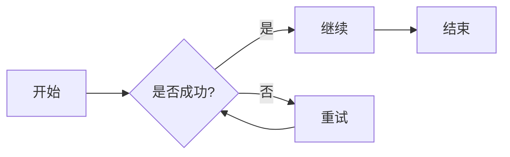
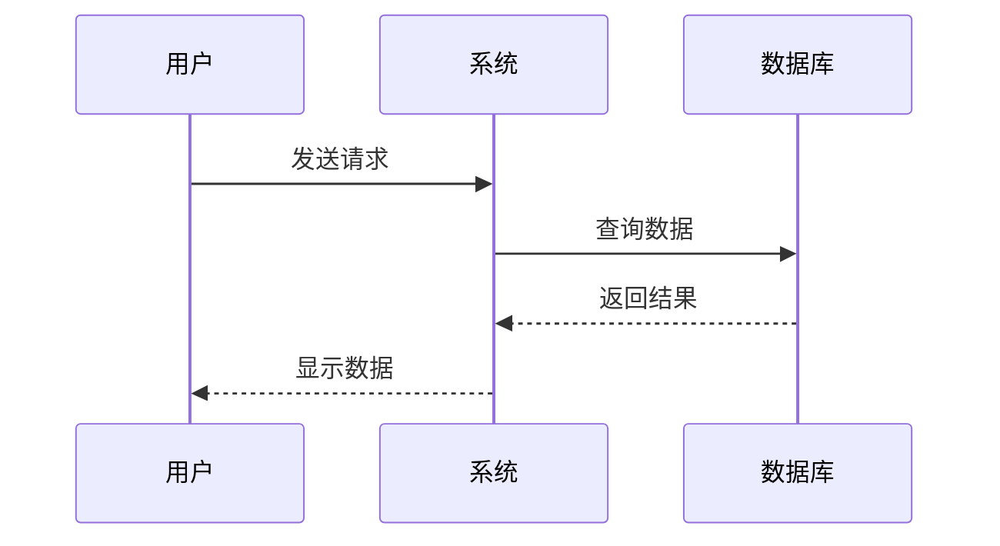
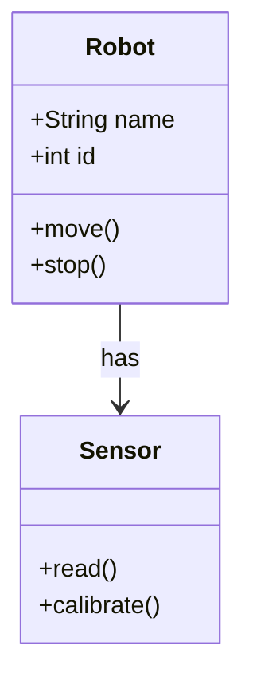
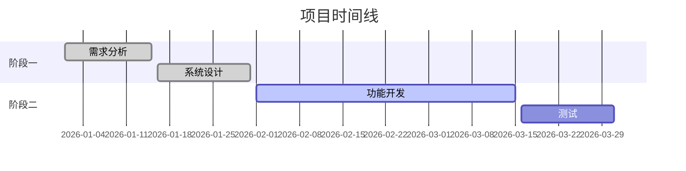
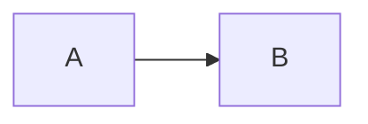

# 组件示例库

本页面展示 Zensical 支持的各种 Markdown 扩展组件及其使用方法。

---

## 1. 提示框 (Admonitions)

提示框用于突出显示重要信息、警告、提示等内容。

### 基本提示框

!!! note "这是一个笔记"
    这是笔记的内容。提示框支持 Markdown 语法，包括**粗体**、*斜体*和`代码`。

!!! info "信息提示"
    用于展示一般性信息。

!!! tip "小贴士"
    分享有用的技巧和建议。

!!! warning "警告"
    提醒用户注意潜在的问题。

!!! danger "危险"
    标记危险或严重的警告。

!!! success "成功"
    表示成功完成的操作。

!!! question "问题"
    提出问题或疑问。

!!! example "示例"
    展示代码或操作示例。

### 可折叠提示框

??? note "点击展开查看详细内容"
    这是一个默认折叠的提示框。点击标题可以展开或折叠内容。
    
    可以包含多个段落和代码：
    ```python
    def hello():
        print("Hello, World!")
    ```

???+ tip "默认展开的可折叠提示框"
    使用 `???+` 可以创建默认展开的可折叠提示框。

### 语法示例

```markdown
!!! note "标题"
    内容

??? warning "可折叠（默认关闭）"
    内容

???+ info "可折叠（默认展开）"
    内容
```

---

## 2. 标签页 (Tabs)

标签页用于在同一空间展示不同的内容选项。

=== "Python"
    ```python
    def fibonacci(n):
        if n <= 1:
            return n
        return fibonacci(n-1) + fibonacci(n-2)
    
    print(fibonacci(10))
    ```

=== "JavaScript"
    ```javascript
    function fibonacci(n) {
        if (n <= 1) return n;
        return fibonacci(n-1) + fibonacci(n-2);
    }
    
    console.log(fibonacci(10));
    ```

=== "C++"
    ```cpp
    #include <iostream>
    
    int fibonacci(int n) {
        if (n <= 1) return n;
        return fibonacci(n-1) + fibonacci(n-2);
    }
    
    int main() {
        std::cout << fibonacci(10) << std::endl;
        return 0;
    }
    ```

### 语法示例

```markdown
=== "标签1"
    内容1

=== "标签2"
    内容2

=== "标签3"
    内容3
```

---

## 3. 代码块增强

### 带行号和高亮

```python linenums="1" hl_lines="2 3"
def calculate_sum(a, b):
    result = a + b  # 这行会被高亮
    return result   # 这行也会被高亮

print(calculate_sum(5, 3))
```

### 带标题的代码块

```python title="example.py"
# 这是一个示例文件
class Robot:
    def __init__(self, name):
        self.name = name
    
    def greet(self):
        return f"Hello, I'm {self.name}"
```

### 内联代码高亮

使用 `:::python print("Hello")` 可以在行内高亮代码。

### 语法示例

````markdown
```python linenums="1" hl_lines="2 3" title="example.py"
代码内容
```
````

---

## 4. 任务列表 (Task Lists)

- [x] 完成需求分析
- [x] 设计系统架构
- [ ] 实现核心功能
- [ ] 编写测试用例
- [ ] 部署到生产环境

### 语法示例

```markdown
- [x] 已完成的任务
- [ ] 未完成的任务
```

---

## 5. 表格

### 基本表格

| 功能 | Python | C++ | JavaScript |
|------|--------|-----|------------|
| 面向对象 | ✅ | ✅ | ✅ |
| 内存管理 | 自动 | 手动 | 自动 |
| 类型系统 | 动态 | 静态 | 动态 |
| 性能 | 中等 | 高 | 中等 |

### 对齐方式

| 左对齐 | 居中对齐 | 右对齐 |
|:-------|:-------:|-------:|
| 内容1 | 内容2 | 内容3 |
| A | B | C |

### 语法示例

```markdown
| 列1 | 列2 | 列3 |
|-----|-----|-----|
| 数据1 | 数据2 | 数据3 |

| 左对齐 | 居中 | 右对齐 |
|:-------|:---:|------:|
```

---

## 6. 键盘按键 (Keys)

按下 ++ctrl+alt+delete++ 可以打开任务管理器。

常用快捷键：
- 复制：++ctrl+c++
- 粘贴：++ctrl+v++
- 保存：++ctrl+s++
- 撤销：++ctrl+z++
- 重做：++ctrl+shift+z++

### 语法示例

```markdown
++ctrl+c++
++ctrl+alt+delete++
```

---

## 7. 脚注 (Footnotes)

这是一段包含脚注的文本[^1]。你也可以使用命名脚注[^note]。

[^1]: 这是第一个脚注的内容。
[^note]: 这是一个命名脚注，可以包含多个段落。

    可以添加缩进来包含更多内容。

### 语法示例

```markdown
文本[^1]

[^1]: 脚注内容
```

---

## 8. 定义列表 (Definition Lists)

机器人
:   一种能够自动执行任务的机械装置。

ROS
:   Robot Operating System，机器人操作系统
:   提供硬件抽象、底层设备控制、常用功能实现等

Zensical
:   基于 Material for MkDocs 的文档生成工具

### 语法示例

```markdown
术语
:   定义内容
```

---

## 9. 表情符号 (Emoji)

使用 `:emoji_name:` 语法插入表情：

- :smile: `:smile:`
- :heart: `:heart:`
- :rocket: `:rocket:`
- :robot: `:robot:`
- :bulb: `:bulb:`
- :warning: `:warning:`
- :white_check_mark: `:white_check_mark:`
- :x: `:x:`

### 语法示例

```markdown
:smile: :heart: :rocket:
```

---

## 10. Mermaid 图表

### 流程图



### 时序图



### 类图



### 甘特图



### 语法示例

````markdown

````

---

## 11. 数学公式 (MathJax)

### 行内公式

爱因斯坦质能方程：$E = mc^2$

圆的面积：$A = \pi r^2$

### 块级公式

$$
\frac{n!}{k!(n-k)!} = \binom{n}{k}
$$

$$
\int_{-\infty}^{\infty} e^{-x^2} dx = \sqrt{\pi}
$$

### 语法示例

```markdown
行内：$公式$
块级：$$公式$$
```

---

## 12. 文本格式化

### 基本格式

- **粗体文本**
- *斜体文本*
- ***粗斜体***
- ~~删除线~~
- ==高亮文本==
- H~2~O（下标）
- X^2^（上标）

### 语法示例

```markdown
**粗体** *斜体* ***粗斜体***
~~删除线~~ ==高亮==
H~2~O X^2^
```

---

## 13. 引用块

> 这是一个简单的引用块。

> **嵌套引用**
> 
> > 这是嵌套的引用内容。
> > 
> > 可以包含多行。

> :bulb: **提示**
> 
> 引用块中也可以使用其他 Markdown 语法：
> 
> - 列表项 1
> - 列表项 2
> 
> ```python
> print("代码块")
> ```

### 语法示例

```markdown
> 引用内容
> > 嵌套引用
```

---

## 14. 水平分割线

使用三个或更多的 `-`、`*` 或 `_` 创建分割线：

---

***

___

### 语法示例

```markdown
---
***
___
```

---

## 15. 链接和图片

### 链接

- [普通链接](https://zensical.org)
- [带标题的链接](https://zensical.org "Zensical 官方文档")
- <https://zensical.org> （自动链接）

### 图片


### 语法示例

```markdown
[链接文本](URL "可选标题")

```

---

## 16. 列表组合

### 嵌套列表

1. 第一项
    - 子项 1
    - 子项 2
        - 子子项 1
2. 第二项
    1. 编号子项 1
    2. 编号子项 2
3. 第三项

### 列表中的代码块

1. 第一步：安装依赖
    
    ```bash
    pip install zensical
    ```

2. 第二步：创建项目
    
    ```bash
    zensical new my-project
    ```

3. 第三步：运行服务
    
    ```bash
    zensical serve
    ```

---

## 17. HTML 和属性

### 使用 HTML

<div style="background-color: #e3f2fd; padding: 15px; border-radius: 5px;">
这是一个使用 HTML 的自定义样式块。
</div>

### Markdown 属性

按钮式链接：[点击这里](#){ .md-button .md-button--primary }

图片居中：

{ align=center }

### 语法示例

```markdown
[链接](#){ .md-button }
{ align=center }
```

---

## 总结

以上展示了 Zensical 支持的主要组件类型。你可以根据需要组合使用这些组件来创建丰富的文档内容。

更多详细信息请参考：

- [Zensical 官方文档](https://zensical.org)
- [Material for MkDocs 参考](https://squidfunk.github.io/mkdocs-material/reference/)
- [Python Markdown 扩展](https://python-markdown.github.io/extensions/)
