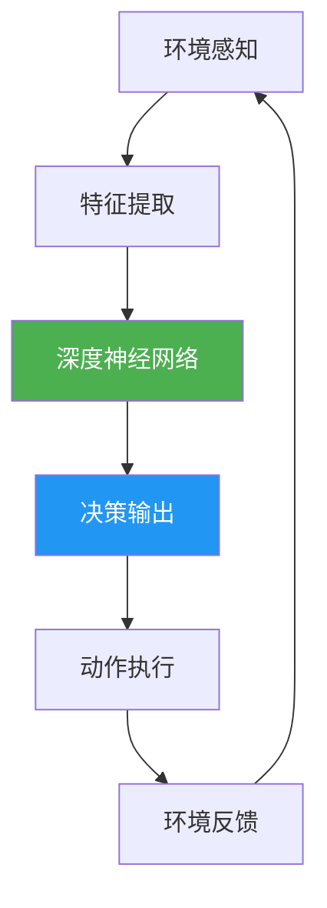
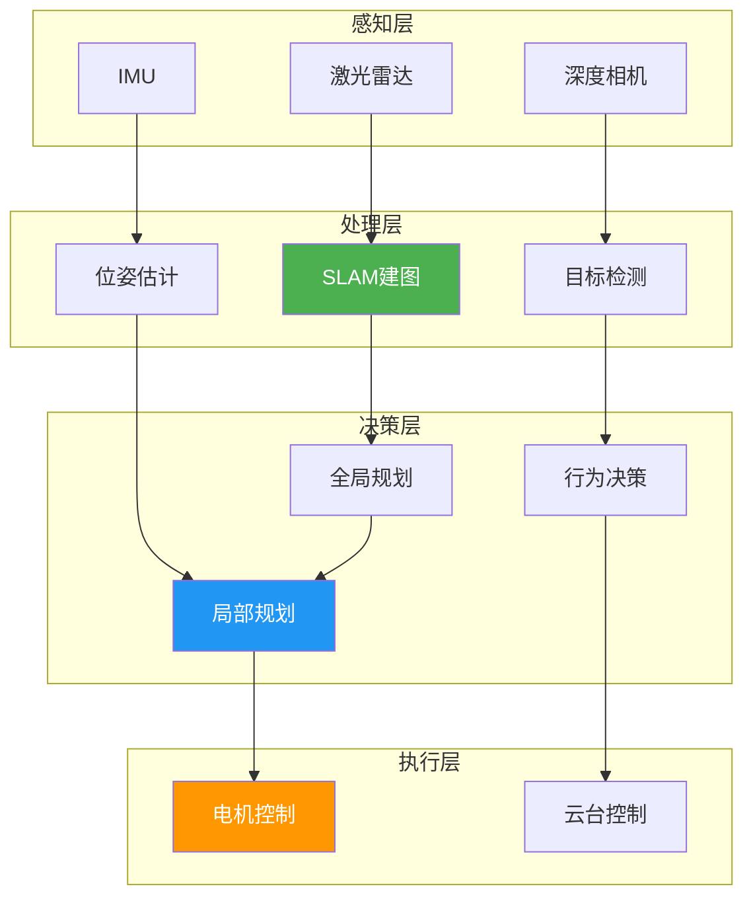
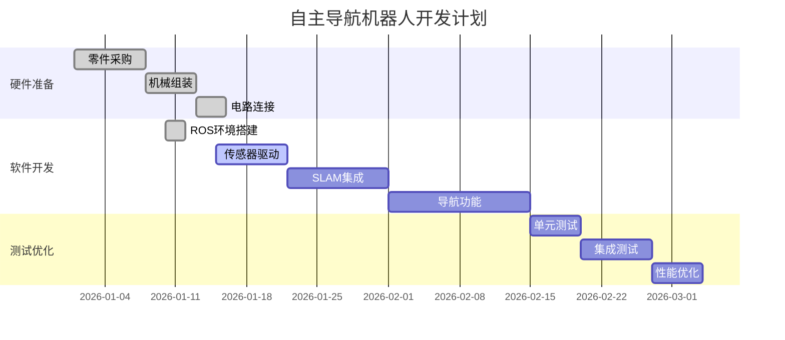
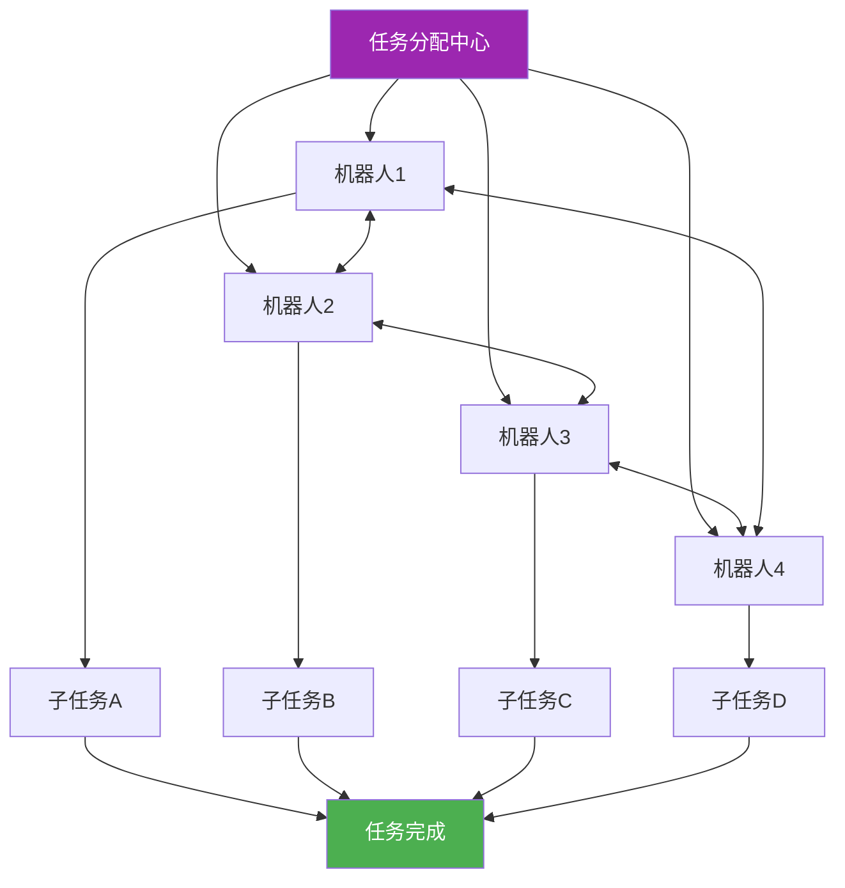

# 机器人技术发展与未来展望

!!! abstract "摘要"
    本文探讨了现代机器人技术的发展历程、核心技术以及未来的发展方向。从工业机器人到服务机器人，从传统控制到人工智能驱动，机器人技术正在深刻改变我们的生活和工作方式。

---

## 引言

机器人技术（Robotics）是一门综合性学科，涉及机械工程、电子工程、计算机科学、人工智能等多个领域。自1954年第一台工业机器人诞生以来，机器人技术经历了快速发展，已经从简单的重复性劳动扩展到复杂的智能决策和人机协作。

### 研究背景

> "机器人将成为21世纪最重要的技术之一。"
> 
> —— 比尔·盖茨

当前，全球机器人产业正处于快速发展期。根据国际机器人联合会（IFR）的数据：

- **2025年**全球工业机器人安装量达到**58.5万台**
- 服务机器人市场规模突破**200亿美元**
- 中国已成为全球最大的机器人市场

---

## 机器人技术的核心组成

机器人系统通常由以下几个关键部分组成：

### 1. 感知系统

感知系统是机器人的"感官"，用于获取环境信息。

=== "视觉传感器"
    - **RGB 相机**：获取彩色图像信息
    - **深度相机**：测量物体距离（如 RealSense, Kinect）
    - **激光雷达（LiDAR）**：高精度环境扫描
    
    ```python
    import cv2
    
    # 使用 OpenCV 读取相机数据
    camera = cv2.VideoCapture(0)
    ret, frame = camera.read()
    
    if ret:
        # 图像处理
        gray = cv2.cvtColor(frame, cv2.COLOR_BGR2GRAY)
        cv2.imshow('Camera Feed', gray)
    ```

=== "运动传感器"
    - **IMU（惯性测量单元）**：测量加速度和角速度
    - **编码器**：测量电机转速和位置
    - **力矩传感器**：测量关节受力情况
    
    ```cpp
    // 读取 IMU 数据示例
    #include <Adafruit_MPU6050.h>
    
    Adafruit_MPU6050 mpu;
    
    void setup() {
        mpu.begin();
        mpu.setAccelerometerRange(MPU6050_RANGE_8_G);
    }
    
    void loop() {
        sensors_event_t a, g, temp;
        mpu.getEvent(&a, &g, &temp);
        
        Serial.print("Accel X: "); Serial.println(a.acceleration.x);
    }
    ```

=== "距离传感器"
    - **超声波传感器**：近距离障碍物检测
    - **红外传感器**：短距离测距
    - **毫米波雷达**：全天候环境感知

### 2. 决策系统

决策系统是机器人的"大脑"，负责处理信息并做出决策。

#### 2.1 传统控制方法

经典的控制算法包括：

1. **PID 控制**
    - 比例（Proportional）
    - 积分（Integral）
    - 微分（Derivative）

2. **状态空间控制**
3. **最优控制（LQR）**

!!! example "PID 控制器实现"
    ```python
    class PIDController:
        def __init__(self, kp, ki, kd):
            self.kp = kp  # 比例系数
            self.ki = ki  # 积分系数
            self.kd = kd  # 微分系数
            
            self.prev_error = 0
            self.integral = 0
        
        def update(self, error, dt):
            # 计算积分项
            self.integral += error * dt
            
            # 计算微分项
            derivative = (error - self.prev_error) / dt
            
            # PID 输出
            output = (self.kp * error + 
                     self.ki * self.integral + 
                     self.kd * derivative)
            
            self.prev_error = error
            return output
    
    # 使用示例
    pid = PIDController(kp=1.0, ki=0.1, kd=0.05)
    target = 100.0
    current = 0.0
    
    while abs(target - current) > 0.1:
        error = target - current
        control = pid.update(error, dt=0.01)
        current += control * 0.01
    ```

#### 2.2 现代人工智能方法

现代机器人越来越多地采用 AI 驱动的决策系统：

- **深度学习**：用于视觉识别、语音理解
- **强化学习**：用于自主导航、操作技能学习
- **大语言模型**：用于人机交互、任务理解



### 3. 执行系统

执行系统是机器人的"肢体"，将决策转化为实际动作。

| 执行器类型 | 优点 | 缺点 | 应用场景 |
|-----------|------|------|---------|
| **电机驱动** | 精度高、易控制 | 能量密度低 | 工业机械臂 |
| **液压驱动** | 力量大、刚性好 | 体积大、噪音大 | 重型工程机器人 |
| **气动驱动** | 安全、轻便 | 精度较低 | 柔性抓取 |
| **人工肌肉** | 柔顺、仿生 | 响应慢、寿命短 | 软体机器人 |

---

## 机器人操作系统（ROS）

ROS（Robot Operating System）是目前最流行的机器人开发框架。

!!! info "ROS 的核心特性"
    - :material-network: **分布式通信**：节点之间通过话题、服务进行通信
    - :material-package-variant: **丰富的工具库**：导航、建图、感知等现成功能包
    - :material-language-python: **多语言支持**：C++、Python 等
    - :material-robot: **硬件抽象**：统一的接口访问不同硬件

### ROS 通信机制

#### 话题通信（Topic）

话题是一种发布-订阅模式的异步通信方式。

```python title="publisher.py"
#!/usr/bin/env python3
import rospy
from std_msgs.msg import String

def publisher_node():
    # 初始化节点
    rospy.init_node('hello_publisher', anonymous=True)
    
    # 创建发布者
    pub = rospy.Publisher('hello_topic', String, queue_size=10)
    
    rate = rospy.Rate(10)  # 10 Hz
    
    while not rospy.is_shutdown():
        message = f"Hello ROS! Time: {rospy.get_time()}"
        rospy.loginfo(message)
        pub.publish(message)
        rate.sleep()

if __name__ == '__main__':
    try:
        publisher_node()
    except rospy.ROSInterruptException:
        pass
```

```python title="subscriber.py"
#!/usr/bin/env python3
import rospy
from std_msgs.msg import String

def callback(data):
    rospy.loginfo(f"Received: {data.data}")

def subscriber_node():
    rospy.init_node('hello_subscriber', anonymous=True)
    rospy.Subscriber('hello_topic', String, callback)
    rospy.spin()  # 保持节点运行

if __name__ == '__main__':
    subscriber_node()
```

#### 服务通信（Service）

服务是一种请求-响应模式的同步通信方式。

```python title="add_two_ints_server.py"
#!/usr/bin/env python3
import rospy
from std_srvs.srv import AddTwoInts, AddTwoIntsResponse

def handle_add_two_ints(req):
    result = req.a + req.b
    rospy.loginfo(f"Adding {req.a} + {req.b} = {result}")
    return AddTwoIntsResponse(result)

def add_two_ints_server():
    rospy.init_node('add_two_ints_server')
    service = rospy.Service('add_two_ints', AddTwoInts, handle_add_two_ints)
    rospy.loginfo("Service ready!")
    rospy.spin()

if __name__ == '__main__':
    add_two_ints_server()
```

---

## 关键技术领域

### SLAM（同步定位与建图）

SLAM 是移动机器人的核心技术之一，解决"我在哪里"和"周围环境是什么样"的问题。

??? tip "SLAM 算法分类"
    **基于滤波的方法：**
    - EKF-SLAM（扩展卡尔曼滤波）
    - FastSLAM（粒子滤波）
    
    **基于优化的方法：**
    - Graph SLAM（图优化）
    - ORB-SLAM（视觉 SLAM）
    
    **深度学习方法：**
    - CNN-SLAM
    - DeepVO

#### SLAM 数学基础

SLAM 的核心是状态估计问题。假设机器人状态为 $\mathbf{x}_t$，地图为 $\mathbf{m}$，观测为 $\mathbf{z}_t$，则 SLAM 问题可表示为：

$$
P(\mathbf{x}_{0:t}, \mathbf{m} | \mathbf{z}_{0:t}, \mathbf{u}_{0:t})
$$

其中：
- $\mathbf{x}_{0:t}$：从时刻 0 到 t 的机器人轨迹
- $\mathbf{m}$：环境地图
- $\mathbf{z}_{0:t}$：传感器观测序列
- $\mathbf{u}_{0:t}$：控制输入序列

通过贝叶斯推断，可以递归地更新状态估计：

$$
P(\mathbf{x}_t, \mathbf{m} | \mathbf{z}_{0:t}) = \eta P(\mathbf{z}_t | \mathbf{x}_t, \mathbf{m}) \int P(\mathbf{x}_t | \mathbf{x}_{t-1}, \mathbf{u}_t) P(\mathbf{x}_{t-1}, \mathbf{m} | \mathbf{z}_{0:t-1}) d\mathbf{x}_{t-1}
$$

### 路径规划

路径规划算法负责找到从起点到终点的可行路径。


**常用算法对比：**

| 算法 | 类型 | 时间复杂度 | 最优性 | 适用场景 |
|-----|------|-----------|--------|---------|
| **Dijkstra** | 图搜索 | $O(V^2)$ | ✅ 最优 | 静态已知地图 |
| **A*** | 启发式搜索 | $O(V \log V)$ | ✅ 最优 | 静态已知地图 |
| **RRT** | 采样法 | $O(n \log n)$ | ❌ 次优 | 高维空间 |
| **DWA** | 局部规划 | $O(n^3)$ | 🔸 局部最优 | 动态避障 |

### 机器学习与视觉

现代机器人大量使用深度学习进行感知和决策。

=== "目标检测"
    ```python
    import torch
    from torchvision.models.detection import fasterrcnn_resnet50_fpn
    from PIL import Image
    import torchvision.transforms as T
    
    # 加载预训练模型
    model = fasterrcnn_resnet50_fpn(pretrained=True)
    model.eval()
    
    # 图像预处理
    transform = T.Compose([T.ToTensor()])
    
    # 读取图像
    image = Image.open('scene.jpg')
    image_tensor = transform(image)
    
    # 目标检测
    with torch.no_grad():
        predictions = model([image_tensor])
    
    # 处理结果
    boxes = predictions[0]['boxes']
    labels = predictions[0]['labels']
    scores = predictions[0]['scores']
    
    print(f"检测到 {len(boxes)} 个目标")
    ```

=== "语义分割"
    ```python
    from transformers import SegformerForSemanticSegmentation, SegformerImageProcessor
    from PIL import Image
    import torch
    
    # 加载模型
    processor = SegformerImageProcessor.from_pretrained(
        "nvidia/segformer-b0-finetuned-ade-512-512"
    )
    model = SegformerForSemanticSegmentation.from_pretrained(
        "nvidia/segformer-b0-finetuned-ade-512-512"
    )
    
    # 处理图像
    image = Image.open('street.jpg')
    inputs = processor(images=image, return_tensors="pt")
    
    # 推理
    outputs = model(**inputs)
    logits = outputs.logits
    
    # 获取分割掩码
    segmentation = logits.argmax(dim=1)[0]
    print(f"分割图尺寸: {segmentation.shape}")
    ```

=== "强化学习"
    ```python
    import gymnasium as gym
    import numpy as np
    
    # 创建环境
    env = gym.make('CartPole-v1')
    
    # 简单的 Q-learning
    class QLearningAgent:
        def __init__(self, state_bins, action_space):
            self.q_table = np.zeros((*state_bins, action_space))
            self.learning_rate = 0.1
            self.discount = 0.95
            self.epsilon = 0.1
        
        def get_action(self, state):
            if np.random.random() < self.epsilon:
                return np.random.randint(self.q_table.shape[-1])
            return np.argmax(self.q_table[state])
        
        def update(self, state, action, reward, next_state):
            old_value = self.q_table[state + (action,)]
            next_max = np.max(self.q_table[next_state])
            
            new_value = old_value + self.learning_rate * (
                reward + self.discount * next_max - old_value
            )
            self.q_table[state + (action,)] = new_value
    ```

---

## 实践项目：构建简单的自主导航机器人

让我们通过一个完整的项目来综合运用以上知识。

### 项目目标

构建一个能够在室内环境自主导航的移动机器人，实现以下功能：

- [x] 环境地图构建（SLAM）
- [x] 路径规划
- [x] 动态避障
- [ ] 目标识别
- [ ] 人机交互

### 系统架构



### 项目时间线



### 关键代码实现

??? example "主控制节点"
    ```python title="main_controller.py" linenums="1" hl_lines="15 16 17"
    #!/usr/bin/env python3
    import rospy
    from geometry_msgs.msg import Twist, PoseStamped
    from sensor_msgs.msg import LaserScan
    from nav_msgs.msg import Odometry
    import numpy as np
    
    class NavigationController:
        def __init__(self):
            rospy.init_node('navigation_controller')
            
            # 订阅话题
            self.laser_sub = rospy.Subscriber(
                '/scan', LaserScan, self.laser_callback
            )
            self.odom_sub = rospy.Subscriber(
                '/odom', Odometry, self.odom_callback
            )
            
            # 发布话题
            self.cmd_pub = rospy.Publisher(
                '/cmd_vel', Twist, queue_size=10
            )
            
            # 状态变量
            self.current_pose = None
            self.laser_data = None
            self.goal = PoseStamped()
            
            # 控制参数
            self.max_linear_vel = 0.5  # m/s
            self.max_angular_vel = 1.0  # rad/s
            self.safe_distance = 0.3  # m
            
        def laser_callback(self, msg):
            """处理激光雷达数据"""
            self.laser_data = np.array(msg.ranges)
            
            # 检测障碍物
            min_distance = np.min(self.laser_data[self.laser_data > 0])
            
            if min_distance < self.safe_distance:
                rospy.logwarn(f"障碍物距离: {min_distance:.2f}m")
                self.emergency_stop()
        
        def odom_callback(self, msg):
            """处理里程计数据"""
            self.current_pose = msg.pose.pose
        
        def emergency_stop(self):
            """紧急停止"""
            cmd = Twist()
            cmd.linear.x = 0
            cmd.angular.z = 0
            self.cmd_pub.publish(cmd)
            rospy.loginfo("Emergency stop activated!")
        
        def move_to_goal(self, goal_x, goal_y):
            """移动到目标点"""
            rate = rospy.Rate(10)
            
            while not rospy.is_shutdown():
                if self.current_pose is None:
                    continue
                
                # 计算距离和角度
                dx = goal_x - self.current_pose.position.x
                dy = goal_y - self.current_pose.position.y
                distance = np.sqrt(dx**2 + dy**2)
                
                if distance < 0.1:
                    rospy.loginfo("Goal reached!")
                    self.emergency_stop()
                    break
                
                # 计算控制指令
                angle_to_goal = np.arctan2(dy, dx)
                cmd = Twist()
                cmd.linear.x = min(self.max_linear_vel, distance * 0.5)
                cmd.angular.z = angle_to_goal * 0.5
                
                self.cmd_pub.publish(cmd)
                rate.sleep()
    
    if __name__ == '__main__':
        try:
            controller = NavigationController()
            # 设置目标点
            controller.move_to_goal(5.0, 3.0)
            rospy.spin()
        except rospy.ROSInterruptException:
            pass
    ```

---

## 未来发展趋势

### 1. 具身智能（Embodied AI）

!!! quote "定义"
    具身智能是指将人工智能与物理实体相结合，使 AI 能够通过感知和交互来理解真实世界。

大语言模型（LLM）与机器人的结合正在开启新的可能：

```python
# 使用 GPT-4 进行任务理解
from openai import OpenAI

client = OpenAI()

def understand_task(user_command):
    response = client.chat.completions.create(
        model="gpt-4",
        messages=[
            {"role": "system", "content": "你是一个机器人助手，需要将用户的自然语言指令转换为机器人可执行的动作序列。"},
            {"role": "user", "content": user_command}
        ]
    )
    
    return response.choices[0].message.content

# 示例
command = "请帮我把桌子上的红色杯子拿到厨房"
actions = understand_task(command)
print(actions)
```

### 2. 软体机器人

软体机器人使用柔性材料，具有更好的安全性和适应性：

- 🐙 **仿生设计**：模仿章鱼、毛虫等软体动物
- 🤝 **安全交互**：与人类协作更安全
- 🌊 **环境适应**：可在复杂环境中变形

### 3. 群体机器人

多个机器人协作完成复杂任务：



### 4. 人机共融

未来的机器人将更深入地融入人类社会：

| 应用领域 | 当前状态 | 2030年展望 |
|---------|---------|-----------|
| **医疗健康** | 🔸 手术辅助 | ✅ 自主诊断与治疗 |
| **家庭服务** | 🔸 扫地机器人 | ✅ 全能家政助手 |
| **教育培训** | 🔸 编程教具 | ✅ 个性化AI导师 |
| **工业制造** | ✅ 自动化产线 | ✅ 完全柔性制造 |
| **太空探索** | 🔸 火星车 | ✅ 自主建造基地 |

---

## 结论

机器人技术正在快速发展，从单一功能的工业机器人到智能化、多功能的服务机器人，技术进步令人瞩目。随着人工智能、新材料、传感器等技术的突破，机器人将在更多领域发挥重要作用。

### 关键要点总结

:material-check-circle: **核心技术**：感知、决策、执行三位一体

:material-check-circle: **软件生态**：ROS 提供了完整的开发框架

:material-check-circle: **AI 赋能**：深度学习极大提升机器人智能水平

:material-check-circle: **未来方向**：具身智能、人机共融是大势所趋

### 推荐学习资源

!!! tip "进阶学习"
    **书籍：**
    
    - 📚 《概率机器人》(Probabilistic Robotics) - Sebastian Thrun
    - 📚 《现代机器人学》(Modern Robotics) - Kevin Lynch
    - 📚 《计算机视觉：算法与应用》- Richard Szeliski
    
    **在线课程：**
    
    - 🎓 Coursera: Robotics Specialization (University of Pennsylvania)
    - 🎓 edX: Autonomous Mobile Robots (ETH Zurich)
    - 🎓 Udacity: Robotics Software Engineer Nanodegree
    
    **开源项目：**
    
    - :fontawesome-brands-github: [ROS Tutorials](https://github.com/ros/ros_tutorials)
    - :fontawesome-brands-github: [TurtleBot](https://github.com/turtlebot)
    - :fontawesome-brands-github: [Open-source Robotics Foundation](https://github.com/osrf)

---

## 参考文献

[^1]: Thrun, S., Burgard, W., & Fox, D. (2005). Probabilistic Robotics. MIT Press.

[^2]: International Federation of Robotics. (2025). World Robotics Report 2025.

[^3]: Khatib, O. (1986). Real-time obstacle avoidance for manipulators and mobile robots. International Journal of Robotics Research, 5(1), 90-98.

[^4]: Levine, S., et al. (2016). End-to-end training of deep visuomotor policies. Journal of Machine Learning Research, 17(39), 1-40.

---

<div style="text-align: center; margin-top: 50px; padding: 20px; background-color: #f5f5f5; border-radius: 8px;">
    <p style="font-size: 14px; color: #666;">
        📝 本文最后更新于 2026年8月29日<br>
        ✍️ 作者：RexCore 团队<br>
        📧 联系方式：team@rexcore.org
    </p>
</div>
