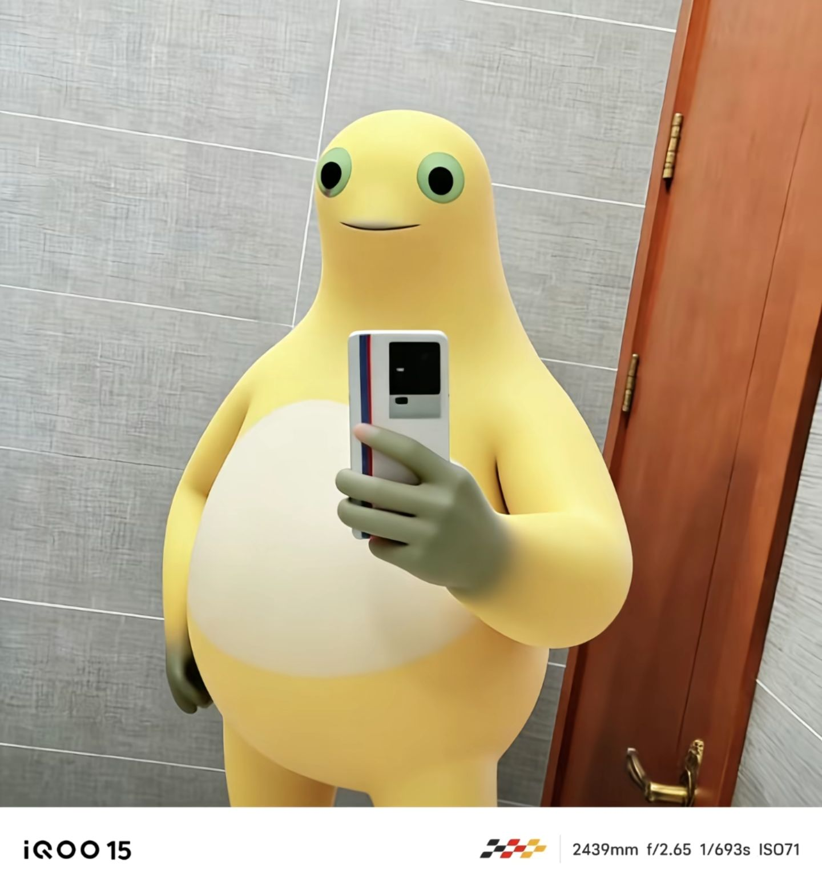
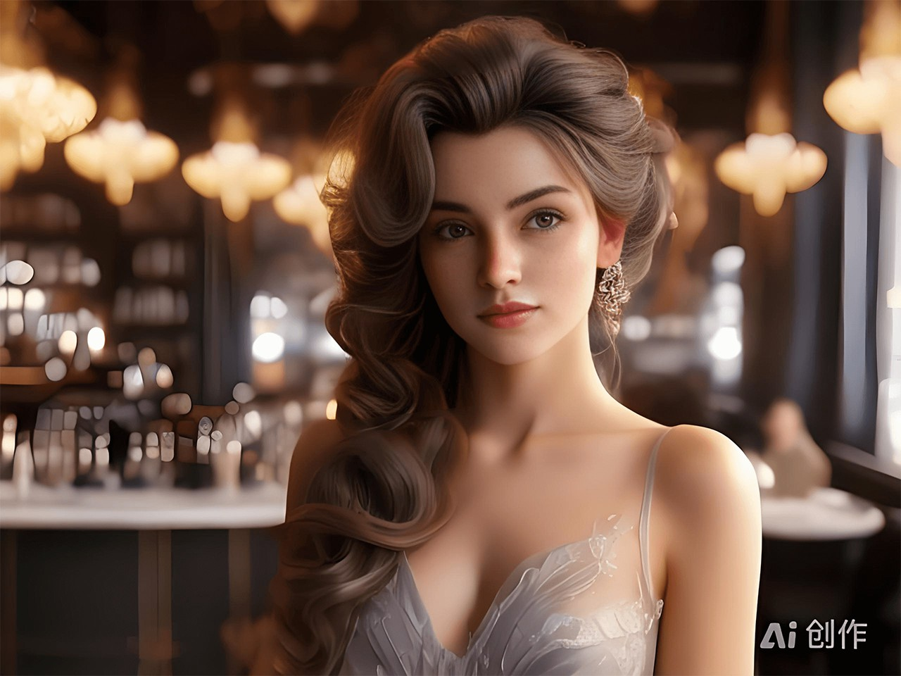

# 图片展示方法示例

本页面展示了 Zensical 文档系统中所有可用的图片展示方法。

---

## 基本图片插入

最简单的图片插入方式：

```markdown

```

效果：


---

## 带标题的图片

使用 HTML 的 `<figure>` 标签添加图片标题：

```html
<figure markdown>
  
  <figcaption>图1：这是一张带标题的图片示例</figcaption>
</figure>
```

效果：

<figure markdown>
  
  <figcaption>图1：这是一张带标题的图片示例</figcaption>
</figure>

---

## 图片对齐方式

### 居中对齐

```html
<div align="center">
  
</div>
```

效果：

<div align="center">
  
</div>

### 左对齐（默认）

```markdown

```

效果：


### 右对齐

```html
<div align="right">
  
</div>
```

效果：

<div align="right">
  
</div>

---

## 图片尺寸控制

### 固定宽度

```html

```

效果：


### 固定高度

```html

```

效果：


### 百分比宽度

```html

```

效果：


---

## 可点击图片（图片链接）

将图片包装在链接中：

```markdown
[](../assets/pic/c273573b6da23fdf73ecc83aad9a8bc81067318816.jpg)
```

效果（点击图片可在新标签页打开）：

[](../assets/pic/c273573b6da23fdf73ecc83aad9a8bc81067318816.jpg){ target="_blank" }

---

## 图片网格布局

使用表格或 CSS Grid 创建图片网格：

### 两列布局

```html
<div style="display: grid; grid-template-columns: 1fr 1fr; gap: 10px;">
  
  
</div>
```

效果：

<div style="display: grid; grid-template-columns: 1fr 1fr; gap: 10px;">
  
  
</div>

### 三列布局

```html
<div style="display: grid; grid-template-columns: repeat(3, 1fr); gap: 10px;">
  
  
  
</div>
```

效果：

<div style="display: grid; grid-template-columns: repeat(3, 1fr); gap: 10px;">
  
  
  
</div>

---

## 带边框和阴影的图片

使用 CSS 样式美化图片：

```html

```

效果：


---

## 圆形图片

```html

```

效果：


---

## 图片与文字混排

### 文字环绕图片（左浮动）

```html

```


这是一段示例文字。当图片设置为左浮动时，文字会自动环绕在图片的右侧。这种布局方式常用于文章配图，可以让页面更加生动有趣。Lorem ipsum dolor sit amet, consectetur adipiscing elit. Sed do eiusmod tempor incididunt ut labore et dolore magna aliqua. Ut enim ad minim veniam, quis nostrud exercitation ullamco laboris.

<div style="clear: both;"></div>

### 文字环绕图片（右浮动）

```html

```


这是另一段示例文字。当图片设置为右浮动时，文字会自动环绕在图片的左侧。这种排版方式可以有效利用空间，让内容更加紧凑。Lorem ipsum dolor sit amet, consectetur adipiscing elit. Sed do eiusmod tempor incididunt ut labore et dolore magna aliqua.

<div style="clear: both;"></div>

---

## 图片画廊（响应式）

```html
<div style="display: grid; grid-template-columns: repeat(auto-fit, minmax(200px, 1fr)); gap: 15px; margin: 20px 0;">
  <div style="text-align: center;">
    
    <p style="margin-top: 8px; font-size: 14px; color: #666;">图片 1</p>
  </div>
  <div style="text-align: center;">
    
    <p style="margin-top: 8px; font-size: 14px; color: #666;">图片 2</p>
  </div>
  <div style="text-align: center;">
    
    <p style="margin-top: 8px; font-size: 14px; color: #666;">图片 3</p>
  </div>
  <div style="text-align: center;">
    
    <p style="margin-top: 8px; font-size: 14px; color: #666;">图片 4</p>
  </div>
  <div style="text-align: center;">
    
    <p style="margin-top: 8px; font-size: 14px; color: #666;">图片 5</p>
  </div>
</div>
```

效果：

<div style="display: grid; grid-template-columns: repeat(auto-fit, minmax(200px, 1fr)); gap: 15px; margin: 20px 0;">
  <div style="text-align: center;">
    
    <p style="margin-top: 8px; font-size: 14px; color: #666;">图片 1</p>
  </div>
  <div style="text-align: center;">
    
    <p style="margin-top: 8px; font-size: 14px; color: #666;">图片 2</p>
  </div>
  <div style="text-align: center;">
    
    <p style="margin-top: 8px; font-size: 14px; color: #666;">图片 3</p>
  </div>
  <div style="text-align: center;">
    
    <p style="margin-top: 8px; font-size: 14px; color: #666;">图片 4</p>
  </div>
  <div style="text-align: center;">
    
    <p style="margin-top: 8px; font-size: 14px; color: #666;">图片 5</p>
  </div>
</div>

---

## 图片对比（Before/After）

```html
<div style="display: flex; gap: 10px; align-items: center;">
  <div style="flex: 1; text-align: center;">
    
    <p><strong>原图</strong></p>
  </div>
  <div style="font-size: 24px; color: #999;">→</div>
  <div style="flex: 1; text-align: center;">
    
    <p><strong>处理后</strong></p>
  </div>
</div>
```

效果：

<div style="display: flex; gap: 10px; align-items: center;">
  <div style="flex: 1; text-align: center;">
    
    <p><strong>原图</strong></p>
  </div>
  <div style="font-size: 24px; color: #999;">→</div>
  <div style="flex: 1; text-align: center;">
    
    <p><strong>处理后</strong></p>
  </div>
</div>

---

## 带说明框的图片

使用 Admonition 与图片结合：

!!! example "示例图片展示"
    
    
    这是一张放在说明框中的图片，可以用于突出显示重要的视觉内容。

!!! tip "提示"
    
    
    您也可以在各种类型的提示框中插入图片。

!!! warning "注意"
    
    
    警告框中的图片可以用于展示需要特别注意的内容。

---

## 图片轮播卡片

使用 Tab 创建图片轮播效果：

=== "图片 1"
    
    
    这是第一张图片的描述信息。

=== "图片 2"
    
    
    这是第二张图片的描述信息。

=== "图片 3"
    
    
    这是第三张图片的描述信息。

=== "图片 4"
    
    
    这是第四张图片的描述信息。

=== "图片 5"
    
    
    这是第五张图片的描述信息。

---

## 图片懒加载

使用 `loading="lazy"` 属性实现懒加载：

```html

```

效果：


---

## 图片滤镜效果

使用 CSS 滤镜为图片添加特效：

### 灰度效果

```html

```


### 模糊效果

```html

```


### 高对比度

```html

```


### 复合滤镜

```html

```


---

## 响应式图片

使用 `srcset` 为不同屏幕提供不同分辨率的图片：

```html

```


---

## 图片叠加文字

在图片上叠加文字：

```html
<div style="position: relative; display: inline-block;">
  
  <div style="position: absolute; bottom: 20px; left: 20px; 
              background: rgba(0,0,0,0.7); color: white; 
              padding: 10px 20px; border-radius: 5px;">
    <h3 style="margin: 0; color: white;">图片标题</h3>
    <p style="margin: 5px 0 0 0;">这是叠加在图片上的描述文字</p>
  </div>
</div>
```

效果：

<div style="position: relative; display: inline-block; width: 100%;">
  
  <div style="position: absolute; bottom: 20px; left: 20px; 
              background: rgba(0,0,0,0.7); color: white; 
              padding: 10px 20px; border-radius: 5px;">
    <h3 style="margin: 0; color: white;">图片标题</h3>
    <p style="margin: 5px 0 0 0;">这是叠加在图片上的描述文字</p>
  </div>
</div>

---

## 总结

本页面展示了在 Zensical 文档系统中使用图片的各种方法，包括：

- ✅ 基本插入与对齐
- ✅ 尺寸控制
- ✅ 图片链接
- ✅ 网格布局
- ✅ 样式美化
- ✅ 文字环绕
- ✅ 画廊展示
- ✅ 滤镜效果
- ✅ 响应式处理
- ✅ 文字叠加

您可以根据实际需求选择合适的展示方式，主人。

---

<div style="text-align: center; margin-top: 50px; padding: 20px; background-color: #f5f5f5; border-radius: 8px;">
    <p style="font-size: 14px; color: #666;">
        📝 图片展示方法示例<br>
        🎨 包含所有常用图片处理技巧
    </p>
</div>
